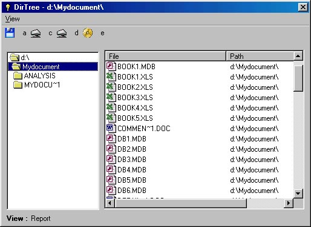



## DirTree

### Description

DirTree is an ongoing project on the lines of Windows explorer. it shows all files present under a directory with their associated icons. Users are free to make use of this code in their projects.
 
### More Info
 
a little knowledge about windows FileSyetemObject object

             |
---                |---
**Submitted On**   |2003-06-30 16:53:20
**By**             |[Manoz Shrivastava](https://github.com/Planet-Source-Code/PSCIndex/blob/master/ByAuthor/manoz-shrivastava.md)
**Level**          |Intermediate
**User Rating**    |4.5 (18 globes from 4 users)
**Compatibility**  |VB 6\.0
**Category**       |[Miscellaneous](https://github.com/Planet-Source-Code/PSCIndex/blob/master/ByCategory/miscellaneous__1-1.md)
**World**          |[Visual Basic](https://github.com/Planet-Source-Code/PSCIndex/blob/master/ByWorld/visual-basic.md)
**Archive File**   |[DirTree160805712003\.zip](https://github.com/Planet-Source-Code/manoz-shrivastava-dirtree__1-46551/archive/master.zip)

